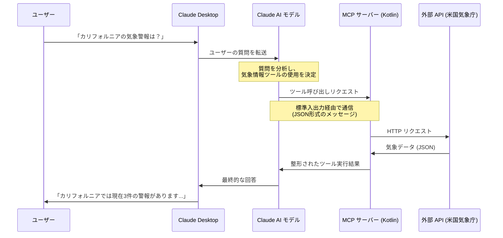

# Kotlin MCP クイックスタート: Claude Desktop と MCP サーバーの連携

このプロジェクトは、[Model Context Protocol (MCP) Kotlin SDK](https://github.com/modelcontextprotocol/kotlin-sdk) を使用した、Claude AI モデルと外部ツール連携のクイックスタート実装例です。公式のクイックスタート [modelcontextprotocol.io/quickstart/server](https://modelcontextprotocol.io/quickstart/server) に基づき、気象情報サービスとの連携を例に、基本的な方法で MCP サーバーを実装しています。

## MCP クイックスタートについて

このプロジェクトは、Model Context Protocol の公式クイックスタートガイド [modelcontextprotocol.io/quickstart/server](https://modelcontextprotocol.io/quickstart/server) に基づいています。公式ガイドで説明されている内容に従って、Kotlin でサーバーを実装しています。

```kotlin
// build.gradle.kts での依存関係
dependencies {
    implementation("io.modelcontextprotocol:kotlin-sdk:1.0.0")
}
```

## Claude と MCP サーバーの通信の流れ



## 具体的な通信内容

Claude と MCP サーバーは「標準入出力（stdin/stdout）」を通じて JSON 形式のメッセージをやり取りします。これは公式クイックスタートで説明されている標準的な通信方法です。

### 1. Claude からのリクエスト例

```json
{
  "type": "callTool",
  "id": "request-123",
  "tool": "get_alerts",
  "arguments": {
    "state": "CA"
  }
}
```

### 2. MCP サーバーからの応答例

```json
{
  "type": "callToolResult",
  "id": "response-123",
  "requestId": "request-123",
  "content": [
    {
      "type": "text",
      "text": "Event: Flood Warning\nArea: San Francisco Bay Area\nSeverity: Moderate\nDescription: Heavy rainfall causing flooding in low-lying areas.\nInstruction: Move to higher ground if in affected areas."
    }
  ]
}
```

## 参考リソース

- [MCP 公式クイックスタート](https://modelcontextprotocol.io/quickstart/server)
- [MCP Kotlin SDK GitHub](https://github.com/modelcontextprotocol/kotlin-sdk)
- [MCP 仕様ドキュメント](https://modelcontextprotocol.ai/docs)
- [Claude Developer Documentation](https://docs.anthropic.com/claude/docs)